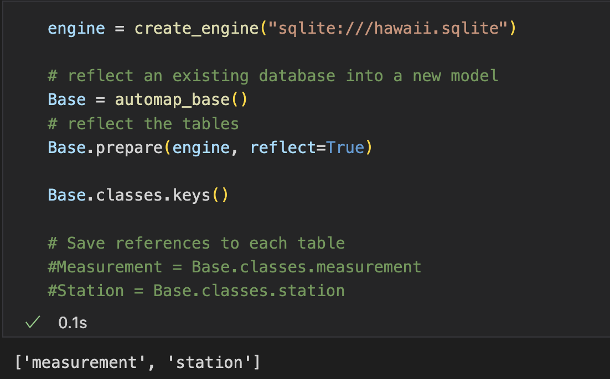
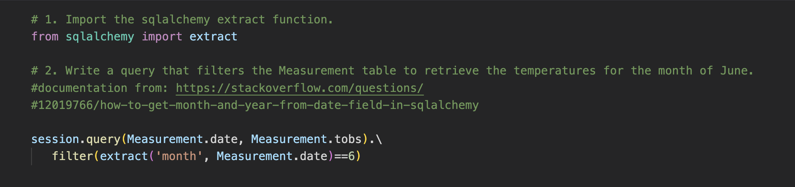
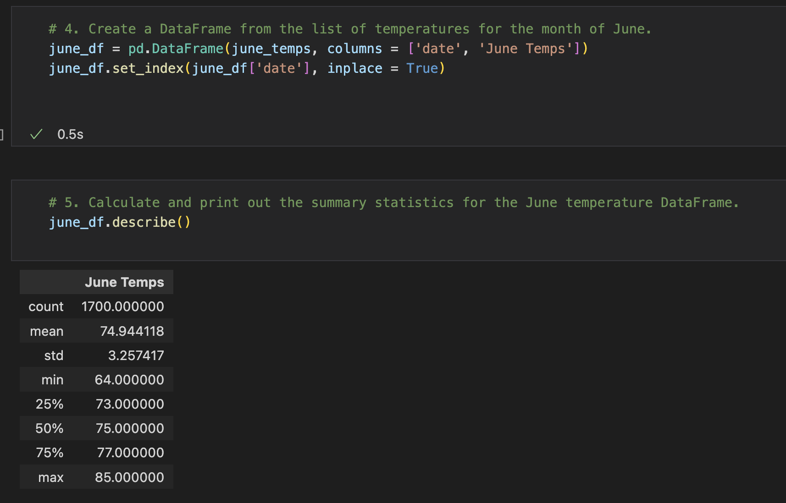
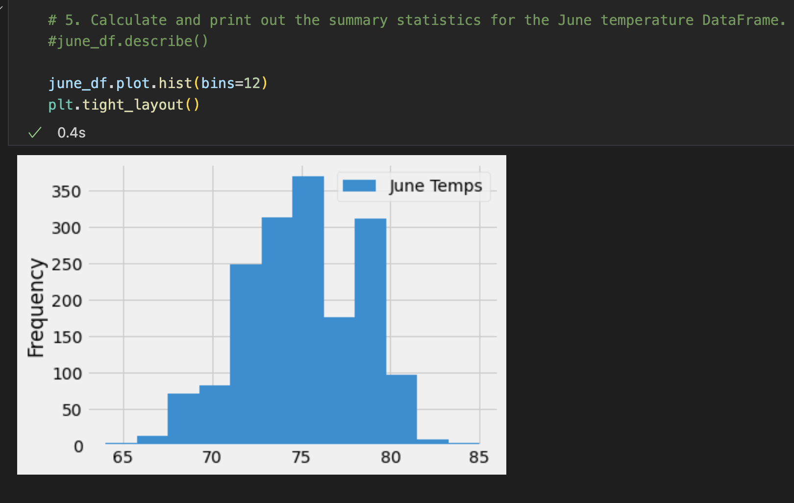
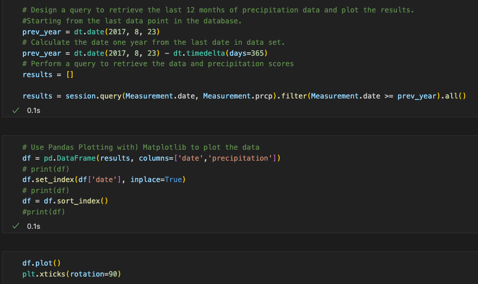
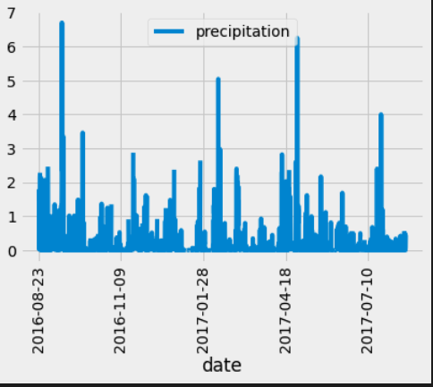
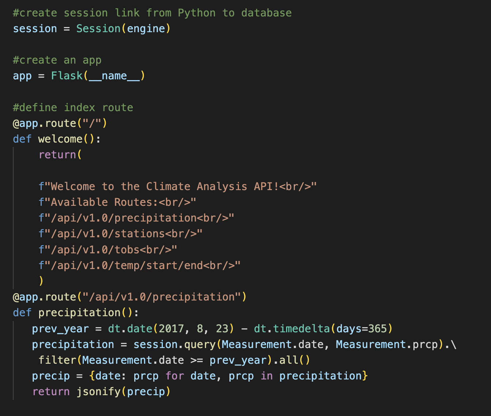

# Surf's Up

Using advanced data query, retrieval, and analysis with SQLite, Flask, and Pandas. 

## Overview

The goal of the project is to take the historical weather data for Hawaii stored in a SQLite database and perform a rigorous analysis to judge how feasible opening a new business on the beach will be.  In order to access the database, the SQLAlchemy toolkit is used to present historical rainfall and temperature trends on the island.  This information is presented to investors using flask to create an accessible webpage.   In the final project, the database is used to extract summary statistics for specific months.

## Results

Unlike a CSV file, dealing with a SQLite database can be challenging to inspect the data as one would a table with column names and rows of data.  I found I needed to use the Base.classes.keys() function often to confirm the keys to reflect into object-relational mapping (OMR) tables.  

I used documentation from StackOverflow to use the extract function in SQLAlchmy to pull data for a particular month from the database

Last, I used Pandas to create a DataFrame from the tables and present the summary statistics

I could have also used Matplotlib to present a visual of the temperature data for June and December

## Summary 

The results show that the temperature remains fairly consistent, staying around the mid-to-upper 70s in June and December making it not too hot and not too cold to enjoy an ice cream by the beach!
I would have included a query to provide a more nuanced look at what months have the highest precipitation since the temperature isn’t the only important factor.  Based on this query, there seem to be some months with a lot of rainfall!  

Additionally, I would have linked the results to the website created by flask 

